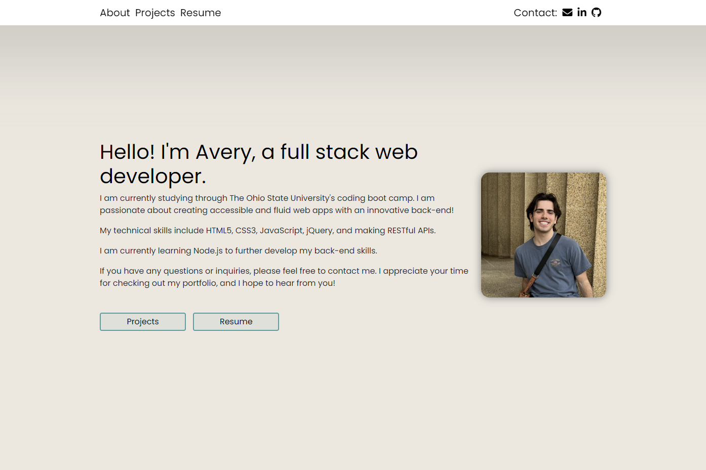

# My Portfolio

## Description
Hello! I'm Avery, a full stack web developer.
I am currently studying through The Ohio State University's coding boot camp. I am passionate about creating accessible and fluid web apps with an innovative back-end!
My technical skills include HTML5, CSS3, JavaScript, jQuery, and making RESTful APIs.
I am currently learning Node.js to further develop my back-end skills.
If you have any questions or inquiries, please feel free to contact me. I appreciate your time for checking out my portfolio, and I hope to hear from you!
## Usage
Checkout my portfolio [here](https://averyjmiller.github.io/my-portfolio/).

